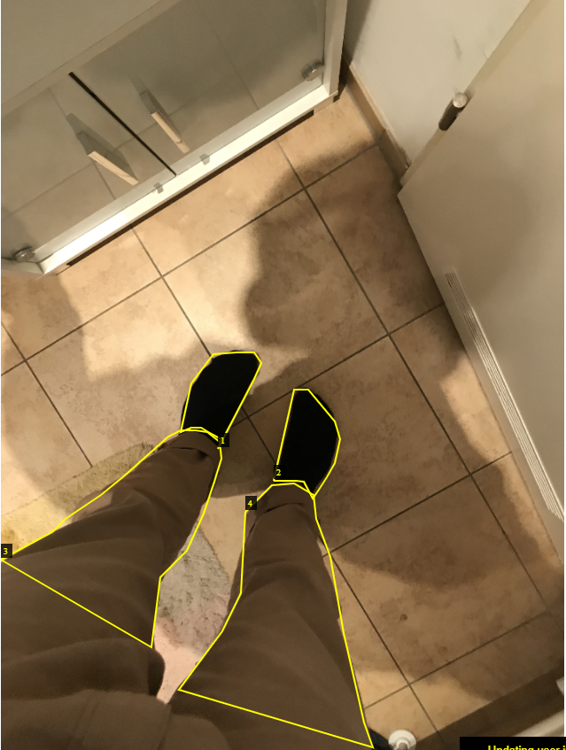
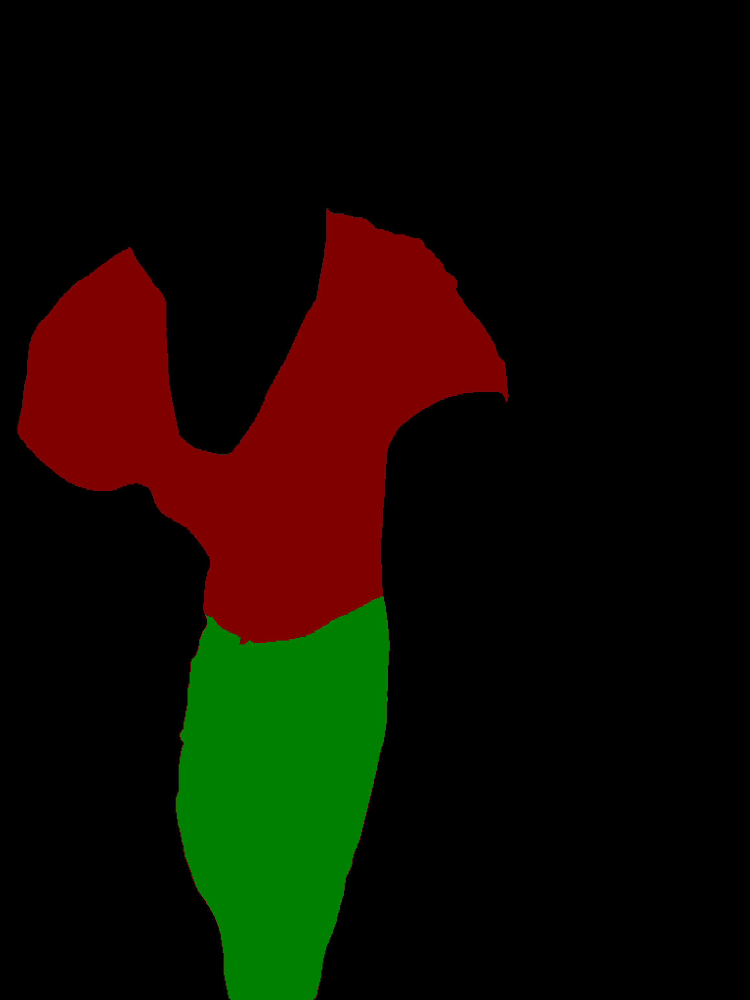

## my-shoe-matting-segmentation

   

   Precise annotation of the people wearing shoes.
   Later corrected with Grab Cut and deep learning based residual fine segmentation tools
   
## Methodologies:
   1. Instead of annotating when people have tried the shoes after taking a picture, its way better to use videos for annotation. Richer data, continuous variations in the poses (angles, distance of filming, etc...)

   Check the following gifs to see:

   2. For each video frame to increase robustness for autoannotation a segmentation model of a person is finetuned, ideally one that is able to split between upper body clothes and lower body ones. Reason being: the shoes with the trousers or naked legs are needed for robust data collection.

   

## Shoe Data Collection

## Image Segmentation:

## Image 
